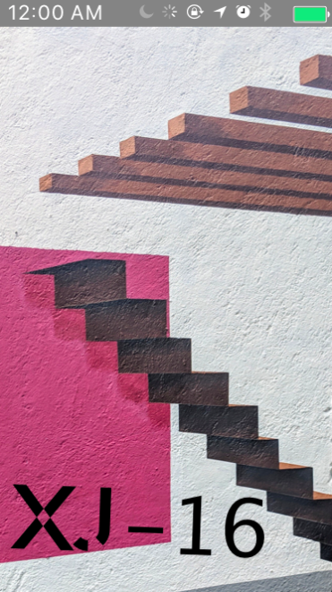

# _XJ-16 Space_

#### _{Brief description of application}, {Date of current version}_

#### By _**Robbie Kruszynski**_

## Description

* _Web buildout for XJ-16 space. Showcasing a welcoming / productive shared workspace for anyone interested. Target demographic ranges "artists, day-traders, craftspeople, writers, counselors, more traditional business people--you know, anyone and everyone--in our space." The website itself will contain a large splash/welcome page that will offer easy navigation to finding out cost of space, offers by XJ16 / perks to being a member, along with locations and amenities._

#### Target User 1
* Nathan - visual artist
* Needs - natural light / personal creative space
* Motivation - cost / access 24/7 / gallery showings in space
* Pain points - lack of work sink at other options / no available space to showcase.
* Tech - viewing / sign up for xj-16 primarily on mobile
#### Story
My name is Nathan and I've been a professional painter for about 5 years. I focus on larger canvas work with abstract expressionism as my focus. Oil is my main medium, which requires ventilation and a cleaning space / sink. In the past I feel the spaces I've worked out of have had some of the requirements I need but have always lacked crucial elements.  Having access to my space 24/7 is very important due to my unknown schedule, along with having the ability to showcase work within the building.

#### Target User 2
* Kate - interior designer (commercial work space)
* Needs - large workspace / natural light / work-boards
* Motivation - surrounded by creative minds for inspiration / personal space to build outside of the work environment
* Pain points - competition does not offer 3-d printer / lack of proper space for ideal workflow / slow and or unreliable internet
* Tech - internet / 3-d printer / fax / printer
#### Story
My name is Kate and I've been in commercial interior design for about 10 years. The study of ascetic and minimalist interior design has been my focus and having a space that resonates with my focus provides a positive space for my mind to create. Being surrounded by other creative minds allows for natural influence which I thrive off of. Due to templates for buildout having space for texture layouts and a 3-d printer to create demos for clients is of upmost importance. Considering my free-lance work / style having a private space to meet with clients / have conference calls promotes my personal brand and professional.

#### Target User 3
* Chris - UX designer
* Needs - common area and welcoming workspace that doesn't feel like an office
* Motivation - fast internet / available monitors to use / great selection of consumables
* Pain points - slow internet / buildout at other offerings felt too much like a typical workspace
* Tech - wifi / external monitors
#### Story
My name is Chris and I've been a UX designer for about six months, and a recent graduate from a coding bootcamp. What I quickly discovered in my internship so I don't seem to do well in an office like setting. Having an open space will allow me to not feel such "restrictions" and provide a healthier environment for me to build in. My career completely revolves around access to reliable internet and I often find places throttle speeds. Having a space that provides monitors to use / rent help give space to create, seeing as bringing personal equipment is clunky and hazardous.

## Research
#### Central office
https://centrloffice.com/
* Consistent color scheme
* Easy to navigate
* Plenty of high quality photos to showcase space
* Smart layout with great readability / "fun" but professional fonts
* Great usage of CSS grid system
* Great inspiration for personal buildout
#### NedSapce
http://www.nedspace.com/
* Basic layout, not exciting
* Little to no photos to view space
* Jarring colors with basic form / information
* Lack of detail and creative outlet creates for a sub par experience
* A good representation of what not to gain inspiration from

#### weWork
https://www.wework.com/
* Welcome page feels a bit busy
* Information presented in an accessible manner
* footer feels clunky
* map on right side with location selection is a nice touch (size needs work)
* Not very friendly in terms of color
* While overall they offer the most, their website jams too much in a small space

####Inspiration

* Easy to find amenities and billing
* Make sure splash page is attractive and doesn't overwhelm the user
* Responsive on mobile with no overflow
* Usage of flex box with spacing or css grid helps store information in an accessable way
* Color scheme to go along with interior layout will provide consistency physical to digital
* Usage of interesting / readable font helps keep interest in provided information
* Avoid "hard" layout / overload of information in a small space

## Specs

####Photos of Paper Sketches
We highly recommend you snap quick photos of your paper sketches, and include them in your README. This depicts your process, and you will be required to include them for larger projects and Friday independent projects.

#### Screenshots of Sketch Wireframes Mobile

#### Screenshots of Sketch Wireframes tablet

#### Screenshots of Sketch Wireframes Desktop

#### List of Technologies Resources

* Sketch v50.2

### Setup/Installation Requirements

* Open your preferred browser
* Or copy / paste https://github.com/Robbiekruszynski/web-design-process be sure you're in your Desktop directory
* clone or download https://github.com/Robbiekruszynski/web-design-process.git Desktop
* Open the web-design-process folder and open the xj-16 sketch file
* Explore xj-16
* Using Sketch version 53.1

#### Description of Responsiveness
After we begin creating responsive sites in week 3, you should also include a description of how this site is responsive. Does it include both mobile and desktop versions? Mobile, desktop and tablet? List that information here.

#### Developmental Roadmap
* Continue to buildout all maps for mobile / desktop / tablet via sketch
* further develop usability
* Buildout using JS/SCSS/CSS/HTML5

## Known Bugs

_As of Feb 22nd 2019 there are no known bugs_

## Support and contact details

_Contact robbiekruszynski@gmail.com with questions and comments_

## Technologies Used

* As of 02/22/19: Sketch

### License

*{This software is licensed under the MIT license} Copyright (c) 2019 {Robbie Kruszynski}*

Copyright (c) 2019 **_Robbie Kruszynski_**
